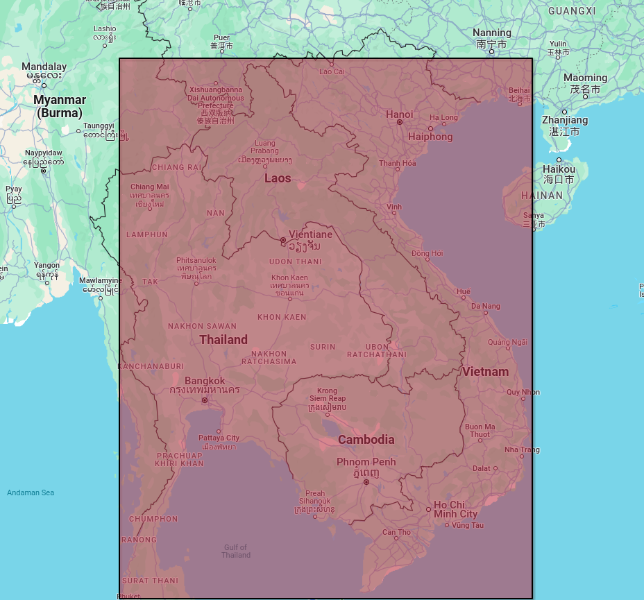

```{r setup, include = FALSE}
# knitr::opts_chunk$set(eval = FALSE)
```

# Uvod


Globalno horizontalno zračenje (GHI), ili ukupna količina kratkotalasnog sunčevog zračenja koje dospe na  zemlj inu površinu, predstavlja ključni parametar za solarne elektrane. Ova vrednost, koja obuhvata i direktno i difuzno sunčevo zračenje, trenutno se meri geo-stacionarnim satelitima.

Predviđanje perioda sa visokim GHI indeksom omogućava solarnim elektranama  proaktivni pristup optimizaciji rada. To se ogleda u:

- Preventivnom održavanju: Planiranje radova van perioda sa visokim potencijalom za proizvodnju solarne energije.
- Optimizaciji performansi: Usklađivanje rada panela i invertera za maksimalni učinak tokom perioda visokog GHI indeksa.
- Strategiji rasporeda radne snage: Obezbeđavanje dovoljno osoblja za praćenje i reagovanje na potencijalne probleme tokom očekivanog vrha u proizvodnji.


# Skup podataka

Skup podataka odnosi se na merenje GHI zracenja na podrucju Vijetnama i javno je dostupan na adresi 
https://data.openei.org/s3_viewer?bucket=nrel-pds-nsrdb&prefix=vietnam%2F, koje je objavila [NREL](https://nsrdb.nrel.gov/) (National Solar Radiation Database) i dostupno je pod licencom Creative Commons Attribution 3.0 United States License.

# Rad

## Instalacija neophodnih paketa i uključivanje biblioteka

``` {r Installing packages ,eval = F, include = T } 
install.packages("BiocManager")
BiocManager::install("rhdf5")
install.packages("kableExtra")
install.packages("ggpubr")
install.packages("sparklyr")
install.packages("caret")
```


``` {r Including libraries, results="hide", message = F}
library(rhdf5)
library(ggplot2)
library(dplyr)
library(magrittr)
library(lubridate)
library(kableExtra)
library(ggpubr)
library(sparklyr)
library(caret)
# Zbog reproduktibilnosti nasumicnih operacija
set.seed(10)
```

## Instaliranje i inicijalizacija spark radnog okruzenja

```{r Installing and setting up spark environment}
spark_install(version="3.3.2")
Sys.setenv(JAVA_HOME="/usr/lib/jvm/java-11-openjdk")
knitr::opts_knit$set(root.dir = "/mnt/StorageSpace/StorageSpace/repositories/ghi-predicting")


# Ovim prosirujemo java heap sparka da bi mogli da smestimo nas set podataka u njega
conf <- spark_config()
conf$`sparklyr.shell.driver-memory` <- "16G"
conf$spark.memory.fraction <- 0.9


sc <- spark_connect(master = "local", version="3.3.2", config = conf)
```

## Ucitavanje podataka u izvornom formatu

Temperaturu vazduha i brzinu vetra takodje je moguce meriti pomocu satelita
``` {r Raw file loading}
h5_file <- H5Fopen("./dataset/vietnam_2016.h5")

air_temp <- h5read(h5_file, "/air_temperature") # celsius
coordinates <- h5read(h5_file, "/coordinates") # angle
ghi <- h5read(h5_file, "/ghi") #W/m^2
meta <- h5read(h5_file, "/meta") # elevation: m
time_index <- h5read(h5_file, "/time_index") # date
wind_speed <- h5read(h5_file, "/wind_speed") # m/s

h5_file
```


Zakljucujemo da imamo 75361 redova zbog 75361 koordinate koje se posmatraju i svaki red sadrzi onoliko kolona koliko je bilo merenja u razlicitim vremenskim trenucima.

Kolona ima koliko i sati koliko je posmatranje trajalo: 366 * 24 = 8784 

## Filtriranje podataka i priprema za obradu

Budući da nas zanima klasifikacija zračenja u letnjem periodu filtriramo podatke koji su
izmereni od 21. juna (172. dan) do 22. septembra (266. dan)

```{r Calculating summer days}
summer_start <- 172 # day number
summer_end <- 266 

summer_hours <- (summer_start * 24) : (summer_end * 24)

sunrise <- 5 
sunset <- 19

sunny_hours <- summer_hours[summer_hours %% 24 %in% (sunrise + 1):(sunset + 1)]


coordinate_step <- 10

#Δlatitude = 5 degrees (differential of latitude)
#Δlongitude = 5 degrees (differential of longitude)

# Earth's average radius ≈ 6,371 kilometers
# Area = 5° * 5° * 6,371 km ≈ 159,275 square kilometers


time_measures_per_coor <- length(sunny_hours)

coor_num = nrow(air_temp)

selected_rows = seq(1, coor_num, by = coordinate_step)

coor_num <- length(selected_rows)
```


Kada smo zakljucili opseg podataka (selected_rows, sunny_hours) za letnji period u suncem obasjanim intervalima,
ekstrahujemo podatke iz h5 matrice i pretvaramo ih u tabelarni format pogodan za dalje koriscenje.
```{r Converting h5 matrix to table representation}

id <- 1:(coor_num * time_measures_per_coor)

latitude <- rep(coordinates[1, selected_rows], each = time_measures_per_coor)
longitude <- rep(coordinates[2, selected_rows], each = time_measures_per_coor)
elevation <- rep(meta[selected_rows,"elevation"], each = time_measures_per_coor)
rm(coordinates)


time <- rep(time_index[sunny_hours], coor_num)

air_temp <- c(air_temp[selected_rows, sunny_hours])
wind_speed <- c(wind_speed[selected_rows, sunny_hours])
ghi <- c(ghi[selected_rows, sunny_hours])

df <- data.frame(id, time, latitude, longitude, elevation, air_temp, wind_speed, ghi)

df <- df %>%
  filter(ghi != 0) %>%
  mutate(time = ymd_hms(strptime(time, "%Y-%m-%d %H:%M:%S")))

# closing all HDF5 handles
h5closeAll()
# removing  helper arrays
rm(id, time, latitude, longitude, elevation, air_temp, wind_speed, ghi, h5_file, meta)
# removing helper values
rm(coor_num, coordinate_step, selected_rows, summer_end, summer_hours, summer_start, sunny_hours, sunrise,
   sunset, time_index, time_measures_per_coor)
```

## Prikaz pripremljenih podataka

### Prvih 10 redova

``` {r Showing first 10 rows, echo = F}
knitr::kable(head(df, n=10),
             col.names = c("id",
                           "time",
                           "latitude[°]",
                           "longitude[°]",
                           "elevation[m]",
                           "air_temp[°C]",
                           "wind_speed[m/s]",
                           "ghi[W/m²]"),
             label = "Tabelarni prikaz prečišćenih podataka",
             format = "html",
             ) %>%
  kableExtra::kable_styling(bootstrap_options = "bordered", full_width = F, font_size = 16)
```


### Nasumicnih 10 redova

```{r Showing random 10 rows, echo = F}

random_rows <- sample(1:nrow(df), size = 10, replace = FALSE)
df_random <- df %>% 
  slice(random_rows)
  
knitr::kable(df_random,
             col.names = c("id",
                           "time",
                           "latitude[°]",
                           "longitude[°]",
                           "elevation[m]",
                           "air_temp[°C]",
                           "wind_speed[m/s]",
                           "ghi[W/m²]"),
             label = "Tabelarni prikaz prečišćenih podataka",
             format = "html",
             ) %>%
  kableExtra::kable_styling(bootstrap_options = "bordered", full_width = F, font_size = 16)
  

rm(random_rows, df_random)
```


## Preliminarna analiza podataka

### Deskriptivne statistike po pojedinačnim obeležjima

#### Opseg geografske sirine, duzine i vremena merenja
```{r Coordinate and time ranges, echo = F}
ranges <- rbind(
  range(df$latitude),
  range(df$longitude),
 format(range(df$time), "%d-%m-%Y %H:%M")  # Include hours (HH) and minutes (MM)
)

colnames(ranges) <- c("Min/Start", "Max/End")
rownames(ranges) <- c("Latitude", "Longitude", "Measurment time")

knitr::kable(format(ranges, scientific  = F),
             label = "Tabelarni prikaz opsega merenja",
             format = "html"
) %>%
  kableExtra::kable_styling(bootstrap_options = "bordered", full_width = FALSE, font_size = 16)
```



#### Deskriptivne statistike preostalih obelezja

```{r Summaries for all the other variables, echo = F}
summaries <- rbind(summary(df$elevation),
                   summary(df$air_temp),
                   summary(df$wind_speed),
                   summary(df$ghi))

rownames(summaries) = c("Elevation[m]", "Air Temperature[°C]", "Wind Speed[m/s]", "GHI[W/m²]")

knitr::kable(summaries,
             label = "Tabelarni prikaz deskriptivnih statistika",
             format = "html"
) %>%
  kableExtra::kable_styling(bootstrap_options = "bordered", full_width = FALSE, font_size = 16)
```


### Vizualizacije raspodela po pojedinačnim obeležjima

```{r Values distribution diagrams, echo=F, fig.width=15, fig.height=15}
plot_elevation <- ggplot(df)+
  geom_histogram(
    mapping = aes(
      x = elevation,
    ),
    bins = 30,
    colour = "black",
    fill = "gray",
  )+
  labs(
    title = "Elevation distribution",
    x = "Elevation [m]",
    y = "Frequency"
  )


plot_air_temp <- ggplot(df)+
  geom_histogram(
    mapping = aes(
      x = air_temp
    ),
    bins = 30,
    colour = "black",
    fill = "gray",
  )+
  labs(
    title = "Air temperature distribution",
    x = "Air temperature [°C]",
    y = "Frequency"
  )

plot_wind_speed <- ggplot(df)+
  geom_density(
    mapping = aes(
      x = wind_speed
    ),
    colour = "black",
    fill = "gray",
  )+
  labs(
    title = "Wind speed distribution",
    x = "Wind speed [m/s]",
    y = "Density"
  )

plot_ghi_dens <- ggplot(df)+
  geom_density(
    mapping = aes(
      x = ghi
    ),
    colour = "black",
    fill = "gray",
  )+
  labs(
    title = "GHI distribution",
    x = "GHI [W/m²]",
    y = "Density"
  )

plot_ghi_box <- ggplot(df) +
  geom_boxplot(mapping = aes(x = ghi)) +
  labs(
    title = "GHI distribution",
    x = "GHI [W/m²]",
  )

ggarrange(plot_elevation,
          plot_air_temp,
          plot_wind_speed,
          plot_ghi_dens,
          plot_ghi_box,
          ncol = 2, nrow = 3)
          


```

### Međusobni odnosi obeležja
```{r Values relationship diagrams, echo = F, fig.width=15, fig.height=15}

# Racunanje se radi za fiksan datum koji je u sred leta, grupise se po x promenljivoj i uzima se srednja vrednost 
# U suprotnom radile bi se grupacija za svaku koordinatu i za svaki vremenski trenutak sto bi preopteretilo grafik i obesmislilo proracun (scatter plot izgleda kao velik pravougaonik)

# Elevation
mean_air_temp <- df %>%
  filter(time >= as.POSIXct("2016-08-06 00:00:00") & time < as.POSIXct("2016-08-07 00:00:00")) %>% 
  group_by(elevation) %>% 
  summarise(mean_temp = mean(air_temp))
  

plot_air_temp_elev <- ggplot(mean_air_temp, aes(x = elevation, y = mean_temp)) +
  geom_point(aes(color = mean_temp)) +
  labs(title = "Air Temperature over Elevation ",
       x = "Elevation",
       y = "Air Temperature",
       color = "Air temperature") +
  theme_bw() 

mean_wind_speed <- df %>%
  filter(time >= as.POSIXct("2016-08-06 00:00:00") & time < as.POSIXct("2016-08-07 00:00:00")) %>% 
  group_by(elevation) %>% 
  summarise(mean_wind_speed = mean(wind_speed))
  

plot_wind_speed_elev <- ggplot(mean_wind_speed, aes(x = elevation, y = mean_wind_speed)) +
  geom_point(aes(color = mean_wind_speed)) +
  labs(title = "Wind speed over Elevation ",
       x = "Elevation",
       y = "Wind Speed",
       color = "Wind speed") +
  theme_bw() 


mean_ghi <- df %>%
  filter(time >= as.POSIXct("2016-08-06 00:00:00") & time < as.POSIXct("2016-08-07 00:00:00")) %>% 
  group_by(elevation) %>% 
  summarise(mean_ghi = mean(ghi))
  

plot_ghi_elev <- ggplot(mean_ghi, aes(x = elevation, y = mean_ghi)) +
  geom_point(aes(color = mean_ghi)) +
  labs(title = "GHI over Elevation",
       x = "Elevation",
       y = "GHI",
       color = "GHI") +
  theme_bw() 


# Wind speed

mean_air_temp <- df %>%
  filter(time >= as.POSIXct("2016-08-06 00:00:00") & time < as.POSIXct("2016-08-07 00:00:00")) %>% 
  group_by(wind_speed) %>% 
  summarise(mean_temp = mean(air_temp))
  

plot_air_temp_wind_speed <- ggplot(mean_air_temp, aes(x = wind_speed, y = mean_temp)) +
  geom_point(aes(color = mean_temp), size = 2) +
  labs(title = "Air Temperature over Wind speed ",
       x = "Wind speed",
       y = "Air Temperature",
       color = "Air temperature") +
  theme_bw() 


mean_ghi <- df %>%
  filter(time >= as.POSIXct("2016-08-06 00:00:00") & time < as.POSIXct("2016-08-07 00:00:00")) %>% 
  group_by(wind_speed) %>% 
  summarise(mean_ghi = mean(ghi))
  

plot_ghi_wind_speed <- ggplot(mean_ghi, aes(x = wind_speed, y = mean_ghi)) +
  geom_point(aes(color = mean_ghi), size = 2) +
  labs(title = "GHI over Wind speed ",
       x = "Wind speed",
       y = "GHI",
       color = "GHI") +
  theme_bw() 

# Air temp

mean_ghi <- df %>%
  filter(time >= as.POSIXct("2016-08-06 00:00:00") & time < as.POSIXct("2016-08-07 00:00:00")) %>% 
  group_by(air_temp) %>% 
  summarise(mean_ghi = mean(ghi))
  

plot_ghi_air_temp <- ggplot(mean_ghi, aes(x = air_temp, y = mean_ghi)) +
  geom_line(aes(color = mean_ghi)) +
  labs(title = "GHI over Air temperature",
       x = "Air temperature",
       y = "GHI",
       color = "GHI") +
  theme_bw() 

ggarrange(plot_air_temp_elev,
          plot_wind_speed_elev,
          plot_ghi_elev,
          plot_air_temp_wind_speed,
          plot_ghi_wind_speed,
          plot_ghi_air_temp,
          ncol = 2, nrow = 3)
```
Sa ovih grafikona može se zaključiti da nadmorska visina nema posebnu povezanost sa bilo kojom preostalom promenljivom dok se mogu uočiti trendovi u odnosima brzine vetra, temperature vazduha i GHI.


```{r Clearing unnecessary variables for further classification, include=F}
to_remove <- setdiff(ls(), c("df", "sc"))
gc(reset = TRUE)
rm(list = to_remove)
rm(to_remove)
```


## Klasifikacija

Klasifikacija je vršena za GHI, gde bi se njegova vrednost klasifikovala kao normalna ili visoka (NORMAL, HIGH), što bi bilo od značaja elektrokompanijama za proaktivan pristup održavanju postrojenja, optimizaciji resursa i raspodeli posla.

### Odabir praga za klasifikaciju i modifikacija polaznog skupa

Kao prag za visoko svetlosno zračenje iako se generalno uzima 600 W/m², na osnovu prethodno iscrtanih grafikona, odabiramo, vrednost trećeg kvartila, kako bi se bolje prilagodili našem konkretnom skupu podataka vezanom za Tajvan.

```{r Introducing GHI classes}
threshold <- quantile(df$ghi, probs = 0.75)
threshold

df %<>% 
  mutate(ghi_c = factor(ifelse(ghi > threshold, "HIGH", "NORMAL")))
```


#### Prvih 10 redova nakon modiifikacije polaznog skupa

```{r Showing first 10 rows after modification, echo = F}
  
knitr::kable(head(df, n = 10),
             col.names = c("id",
                           "time",
                           "latitude[°]",
                           "longitude[°]",
                           "elevation[m]",
                           "air_temp[°C]",
                           "wind_speed[m/s]",
                           "ghi[W/m²]",
                           "ghi categorical"),
             label = "Tabelarni prikaz modifikovanog skupa podataka",
             format = "html",
             ) %>%
  kableExtra::kable_styling(bootstrap_options = "bordered", full_width = F, font_size = 16)
  
```
### Priprema skupa podataka za visestruku validaciju

```{r k-fold cross validation preparations}

k_folds <- 5

# Promesamo podatke 
df_shuffled <- df[sample(nrow(df)), ]
df_shuffled %<>% 
  mutate(id = 1:nrow(df)) # radi laseg samplovanja
  
# Prebacimo u tbl_spark zbog dalje obrade
df_spark <- copy_to(sc, df_shuffled, "df_spark", overwrite = TRUE)

# ML funkcije ne podrzavaju timestamp, pa se vreme prebacuje u numeric
df_spark %<>%
  mutate(time_numeric = as.numeric(time))

formula <- ghi_c ~ air_temp + wind_speed + longitude + latitude + time_numeric


# Funkcija za deljenje podataka za k-fold validaciju
split_data <- function(data, fold_num, fold_size) {
  
  test_start <- (fold_num - 1) * fold_size + 1
  test_end <- test_start + fold_size - 1
  
  test_set <- data %>%
    filter(id >= test_start & id <= test_end)
  
  train_set <- data %>%
    filter(!(id >= test_start & id <= test_end))  
  
  return(list(train_set = train_set, test_set = test_set))
}

# Opste potrebni podaci za visestruku validaciju
row_num <- count(df_spark) %>% collect()
row_num <- row_num[[1,1]]
fold_size <- row_num %/% k_folds
```


### Logistička regresija

Podešavani hiperparametri:

* **reg_parameter - regularizacioni parametar (lambda)**
    * poznat i kao kazneni član, pomaže u sprečavanju pretreniranja dodavanjem kazne za veće koeficijente.
        * 0 - bez regularizacije
        * 0.001 - mala kolicina regularizacije
        * 0.1 - umerena regularizacija
* **max_iterations - maksimalni broj iteracija algoritma**
    * 100 - podrazumevan broj
    * 500 - povećan broj iteracija
    * 1000 - velik broj iteracija

```{r Logistic regression}
start_time <- proc.time()

reg_parameter <- c(0, 0.001, 0.1)
max_iterations <- c(100, 500, 1000)

accuracies <- numeric(3)
precisions <- numeric(3)
recalls <- numeric(3)
f_measures <- numeric(3)

for(scenario in 1:3){
  accuracy_sum <- 0
  precision_sum <- 0
  recall_sum <- 0
  f_measure_sum <- 0
  
  for(i in 1:k_folds){
    paritioned_data <- split_data(df_spark, i, fold_size)
    
    logreg <- ml_logistic_regression(paritioned_data$train_set,
                                     formula,
                                     reg_param = reg_parameter[scenario],
                                     max_iter = max_iterations[scenario],
                                     family = "binomial")
    
    evaluation <- ml_evaluate(logreg, dataset=paritioned_data$test_set)
    
    accuracy_sum <- accuracy_sum + evaluation$accuracy()
    precision_sum <- precision_sum + evaluation$weighted_precision()
    recall_sum <- recall_sum + evaluation$weighted_recall()
    f_measure_sum <- f_measure_sum + evaluation$weighted_f_measure()
  }
  
  accuracies[scenario] <- accuracy_sum / k_folds
  precisions[scenario] <- precision_sum / k_folds
  recalls[scenario] <- recall_sum / k_folds
  f_measures[scenario] <- f_measure_sum / k_folds
}

# Prikaz rezultata
results_logreg <- data.frame(accuracies,
                      precisions,
                      recalls,
                      f_measures)

rownames(results_logreg) <- c("Scenario 1", "Scenario 2", "Scenario 3")
colnames(results_logreg) <- c("Accuracy", "Precision", "Recall", "F Measure")

knitr::kable(results_logreg,
             label = "Prikaz rezultata logisticke regresije",
             format = "html"
) %>%
  kableExtra::kable_styling(bootstrap_options = "bordered", full_width = FALSE, font_size = 16)
end_time <- proc.time()
elapsed = end_time-start_time
print(paste("Elapsed time:",round(elapsed[3] / 60,2)))
```

#### Odnosi hiperparametara i performansi

```{r Logistic regression parameters vs performance, echo = F, fig.width=10, fig.height=10}

plotting_df <- cbind(results_logreg, reg_parameter, max_iterations)


plot_reg_param_acc <- ggplot(plotting_df) +
  geom_point(mapping = aes(x = reg_parameter, y = accuracies)) +
  labs(title = "Accuracy over Regularization parameter",
       x = "Regularization parameter",
       y = "Accuracy") +
  theme_bw() 


plot_reg_param_prec <- ggplot(plotting_df) +
  geom_point(mapping = aes(x = reg_parameter, y = precisions)) +
  labs(title = "Precision over Regularization parameter",
       x = "Regularization parameter",
       y = "Precision") +
  theme_bw() 

plot_reg_param_rec <- ggplot(plotting_df) +
  geom_point(mapping = aes(x = reg_parameter, y = recalls)) +
  labs(title = "Recall over Regularization parameter",
       x = "Regularization parameter",
       y = "Recall") +
  theme_bw() 

plot_reg_param_f <- ggplot(plotting_df) +
  geom_point(mapping = aes(x = reg_parameter, y = f_measures)) +
  labs(title = "F measure over Regularization parameter",
       x = "Regularization parameter",
       y = "F measure ") +
  theme_bw() 


ggarrange(plot_reg_param_acc,
          plot_reg_param_prec,
          plot_reg_param_rec,
          plot_reg_param_f,
          ncol = 2, nrow = 2)


plot_max_iter_acc <- ggplot(plotting_df) +
  geom_point(mapping = aes(x = max_iterations, y = accuracies)) +
  labs(title = "Accuracy over Max iterations",
       x = "Max iterations",
       y = "Accuracy") +
  theme_bw() 


plot_max_iter_prec <- ggplot(plotting_df) +
  geom_point(mapping = aes(x = max_iterations, y = precisions)) +
  labs(title = "Precision over Max iterations",
       x = "Max iterations",
       y = "Precision") +
  theme_bw() 

plot_max_iter_rec <- ggplot(plotting_df) +
  geom_point(mapping = aes(x = max_iterations, y = recalls)) +
  labs(title = "Recall over Max iterations",
       x = "Max iterations",
       y = "Recall") +
  theme_bw() 

plot_max_iter_f <- ggplot(plotting_df) +
  geom_point(mapping = aes(x = max_iterations, y = f_measures)) +
  labs(title = "F measure over Max iterations",
       x = "Max iterations",
       y = "F measure ") +
  theme_bw() 


ggarrange(plot_max_iter_acc,
          plot_max_iter_prec,
          plot_max_iter_rec,
          plot_max_iter_f,
          ncol = 2, nrow = 2)
```


### Linear SVC

Podešavani hiperparametri:

* **reg_parameter - regularizacioni parametar (lambda)**
    * poznat i kao kazneni član, pomaže u sprečavanju pretreniranja dodavanjem kazne za veće koeficijente.
        * 0 - bez regularizacije
        * 0.001 - mala kolicina regularizacije
        * 0.1 - umerena regularizacija
* **max_iterations - maksimalni broj iteracija algoritma**
    * 100 - podrazumevan broj
    * 500 - povećan broj iteracija
    * 1000 - velik broj iteracija


```{r Linear SVC}
start_time <- proc.time()
#### Obucanvanje i validacija
reg_parameter <- c(0, 0.001, 0.1)
max_iterations <- c(100, 500, 1000)

accuracies <- numeric(3)

for(scenario in 1:3){
  accuracy_sum <- 0
  print(paste("USO (scen, iter)", scenario, i))
  
  for(i in 1:k_folds){
    paritioned_data <- split_data(df_spark, i, fold_size)
    
    lsvc <- ml_logistic_regression(paritioned_data$train_set,
                                     formula,
                                     reg_param = reg_parameter[scenario],
                                     max_iter = max_iterations[scenario])
    
    evaluation <- ml_evaluate(lsvc, dataset=paritioned_data$test_set)
    
    accuracy_sum <- accuracy_sum + evaluation$accuracy()
  }
  
  accuracies[scenario] <- accuracy_sum / k_folds
}

# Prikaz rezultata
results_lsvc <- data.frame(accuracies)

rownames(results_lsvc) <- c("Scenario 1", "Scenario 2", "Scenario 3")
colnames(results_lsvc) <- c("Accuracy")

knitr::kable(results_lsvc,
             label = "Prikaz rezultata Linear Support Vector Classifier",
             format = "html"
) %>%
  kableExtra::kable_styling(bootstrap_options = "bordered", full_width = FALSE, font_size = 16)
end_time <- proc.time()
elapsed = end_time-start_time
print(paste("Elapsed time:",round(elapsed[3] / 60,2)))
```


### Decision tree

* **max_depth - maksimalna dubina stabla**
    * Određuje maksimalnu dubinu pojedinačnog stabla. Dublje drveće može uhvatiti složenije obrasce u podacima, ali su takođe sklonija preobučavanju.
        * 5 -  umerena dubina
        * 10 -  dublje drveće
        * 20 -  vrlo duboko drveće

* **min_instances_per_node - minimalan broj instanci po čvoru**
    * Definiše minimalan broj instanci koji se moraju nalaziti u čvoru stabla pre nego što se on može podeliti na dva deteta. Veća vrednost može sprečiti preobučavanje forsiranjem modela da razmotri više podataka prilikom deljenja čvorova.
    * Vrijednosti za probno podešavanje \- 
        * 2 -  niska vrednost
        * 5 -  umerena vrednost
        * 10 -  visoka vrednost


```{r Decision tree}
start_time <- proc.time()
#### Obucanvanje i validacija
max_depth <- c(5,10,20)
min_instances_per_node <- c(2,5,10)

accuracies <- numeric(3)

for(scenario in 1:3){
  accuracy_sum <- 0
  for(i in 1:k_folds){
    print(paste("USO (scen, iter)", scenario, i))
    paritioned_data <- split_data(df_spark, i, fold_size)
    
    dt <- ml_decision_tree_classifier(paritioned_data$train_set,
                                  formula,
                                  max_depth = max_depth[scenario],
                                  min_instances_per_node = min_instances_per_node[scenario]
    )
    
    evaluation <- ml_evaluate(dt, dataset=paritioned_data$test_set)
    
    accuracy_sum <- accuracy_sum + evaluation$Accuracy
  }
  
  accuracies[scenario] <- accuracy_sum / k_folds
}

# Prikaz rezultata
results_dt <- data.frame(accuracies)
# 
rownames(results_dt) <- c("Scenario 1", "Scenario 2", "Scenario 3")
colnames(results_dt) <- c("Accuracy")
# 
knitr::kable(results_dt,
             label = "Prikaz rezultata Descision tree",
             format = "html"
) %>%
  kableExtra::kable_styling(bootstrap_options = "bordered", full_width = FALSE, font_size = 16)
end_time <- proc.time()
elapsed = end_time-start_time
print(paste("Elapsed time:",round(elapsed[3] / 60,2)))
```

## Zatvaranje spark konekcije
```{r Closing spark context}
spark_disconnect(sc)
```
