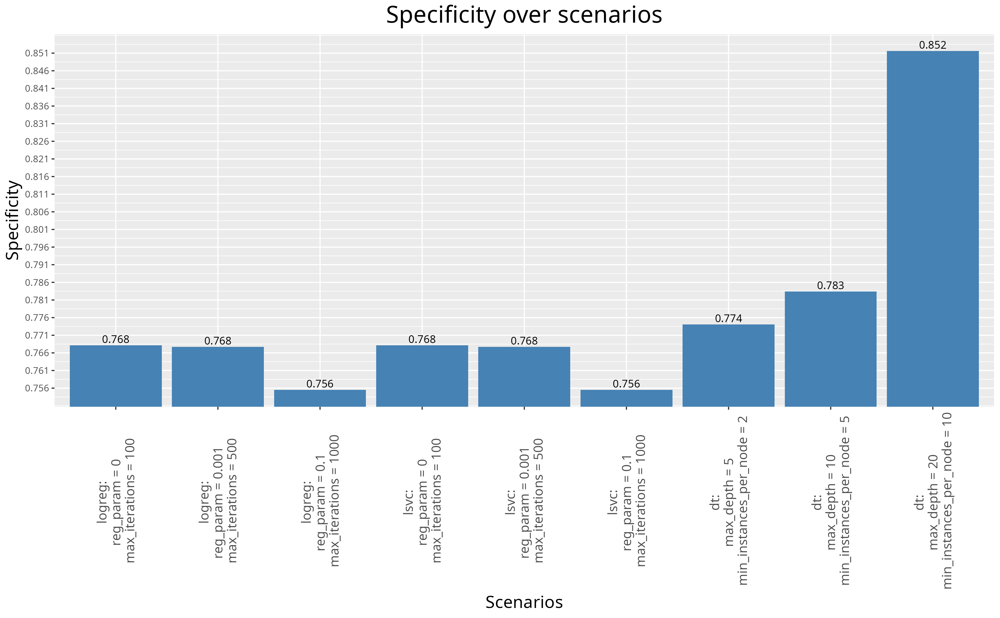

```{r setup, include = FALSE}
  knitr::opts_chunk$set(eval = F)
```

# Uvod


Globalno horizontalno zračenje (GHI), ili ukupna količina kratkotalasnog sunčevog zračenja koje dospe na  zemljinu površinu, predstavlja ključni parametar za solarne elektrane. Ova vrednost, koja obuhvata i direktno i difuzno sunčevo zračenje, trenutno se meri geo-stacionarnim satelitima.

Predviđanje perioda sa visokim GHI indeksom omogućava solarnim elektranama  proaktivni pristup optimizaciji rada. To se ogleda u:

- Preventivnom održavanju: Planiranje radova van perioda sa visokim potencijalom za proizvodnju solarne energije.
- Optimizaciji performansi: Usklađivanje rada panela i invertera za maksimalni učinak tokom perioda visokog GHI indeksa.
- Strategiji rasporeda radne snage: Obezbeđavanje dovoljno osoblja za praćenje i reagovanje na potencijalne probleme tokom očekivanog vrha u proizvodnji.


# Skup podataka

Skup podataka odnosi se na merenje GHI zračenja na podrucju Vijetnama i javno je dostupan na adresi 
https://data.openei.org/s3_viewer?bucket=nrel-pds-nsrdb&prefix=vietnam%2F, koje je objavila [NREL](https://nsrdb.nrel.gov/) (National Solar Radiation Database) i dostupno je pod licencom Creative Commons Attribution 3.0 United States License.

# Korišćene tehnologije

* R
* RStudio
* Apache Spark

# Rad

## Instalacija neophodnih paketa i uključivanje biblioteka

``` {r Installing packages ,eval = F, include = T } 
install.packages("BiocManager")
BiocManager::install("rhdf5")
install.packages("kableExtra")
install.packages("ggpubr")
install.packages("sparklyr")
install.packages("caret")
install.packages("webshot2")
```


``` {r Including libraries, results="hide", message = F}
library(rhdf5)
library(ggplot2)
library(dplyr)
library(magrittr)
library(lubridate)
library(kableExtra)
library(ggpubr)
library(sparklyr)
library(caret)
library(webshot2)
set.seed(10)
```

## Instaliranje i inicijalizacija Spark radnog okruženja

```{r Installing and setting up spark environment}
spark_install(version="3.3.2")
Sys.setenv(JAVA_HOME="/usr/lib/jvm/java-11-openjdk")
knitr::opts_knit$set(root.dir = "/mnt/StorageSpace/StorageSpace/repositories/ghi-predicting")


# Ovim prosirujemo java heap sparka da bi mogli da smestimo nas set podataka u njega
conf <- spark_config()
conf$`sparklyr.shell.driver-memory` <- "16G"
conf$spark.memory.fraction <- 0.9


sc <- spark_connect(master = "local", version="3.3.2", config = conf)
```

## Učitavanje podataka u izvornom formatu

Temperaturu vazduha i brzinu vetra takođe je moguće meriti pomoću satelita.
``` {r Raw file loading}
h5_file <- H5Fopen("./dataset/vietnam_2016.h5")

air_temp <- h5read(h5_file, "/air_temperature") # celsius
coordinates <- h5read(h5_file, "/coordinates") # angle
ghi <- h5read(h5_file, "/ghi") #W/m^2
meta <- h5read(h5_file, "/meta") # elevation: m
time_index <- h5read(h5_file, "/time_index") # date
wind_speed <- h5read(h5_file, "/wind_speed") # m/s


kable_out <- knitr::kable(h5ls(h5_file) %>% 
             select(name,dclass,dim),
             format = "html",
             ) %>%
kableExtra::kable_styling(bootstrap_options = "bordered", full_width = F, font_size = 16) 

save_kable(kable_out, file = "tables/hdf5_structure.png") 
```
<center></center>


Zaključujemo da imamo 75361 redova zbog 75361 koordinate koje se posmatraju i svaki red sadrži onoliko kolona koliko je bilo merenja u različitim vremenskim trenucima.

Kolona ima koliko i sati koliko je posmatranje trajalo: 366 * 24 = 8784 

## Filtriranje podataka i priprema za obradu

Budući da nas zanima klasifikacija zračenja u letnjem periodu filtriramo podatke koji su
izmereni od 21. juna (172. dan) do 22. septembra (266. dan).

```{r Calculating summer days}
summer_start <- 172 # day number
summer_end <- 266 

summer_hours <- (summer_start * 24) : (summer_end * 24)

sunrise <- 5 
sunset <- 19

sunny_hours <- summer_hours[summer_hours %% 24 %in% (sunrise + 1):(sunset + 1)]


coordinate_step <- 10

#Δlatitude = 5 degrees (differential of latitude)
#Δlongitude = 5 degrees (differential of longitude)

# Earth's average radius ≈ 6,371 kilometers
# Area = 5° * 5° * 6,371 km ≈ 159,275 square kilometers


time_measures_per_coor <- length(sunny_hours)

coor_num = nrow(air_temp)

selected_rows = seq(1, coor_num, by = coordinate_step)

coor_num <- length(selected_rows)
```


Kada smo zaključili opseg podataka (selected_rows, sunny_hours) za letnji period u suncem obasjanim intervalima,
ekstrahujemo podatke iz h5 matrice i pretvaramo ih u tabelarni format pogodan za dalje korišćenje.
```{r Converting h5 matrix to table representation}

id <- 1:(coor_num * time_measures_per_coor)

latitude <- rep(coordinates[1, selected_rows], each = time_measures_per_coor)
longitude <- rep(coordinates[2, selected_rows], each = time_measures_per_coor)
elevation <- rep(meta[selected_rows,"elevation"], each = time_measures_per_coor)
rm(coordinates)


time <- rep(time_index[sunny_hours], coor_num)

air_temp <- c(air_temp[selected_rows, sunny_hours])
wind_speed <- c(wind_speed[selected_rows, sunny_hours])
ghi <- c(ghi[selected_rows, sunny_hours])

df <- data.frame(id, time, latitude, longitude, elevation, air_temp, wind_speed, ghi)

df <- df %>%
  filter(ghi != 0) %>%
  mutate(time = ymd_hms(strptime(time, "%Y-%m-%d %H:%M:%S")))

# closing all HDF5 handles
h5closeAll()
# removing  helper arrays
rm(id, time, latitude, longitude, elevation, air_temp, wind_speed, ghi, h5_file, meta)
# removing helper values
rm(coor_num, coordinate_step, selected_rows, summer_end, summer_hours, summer_start, sunny_hours, sunrise,
   sunset, time_index, time_measures_per_coor)
```

## Prikaz pripremljenih podataka

### Prvih 10 redova

``` {r Showing first 10 rows, echo = F}
kable_out <- knitr::kable(head(df, n=10),
             col.names = c("id",
                           "time",
                           "latitude[°]",
                           "longitude[°]",
                           "elevation[m]",
                           "air_temp[°C]",
                           "wind_speed[m/s]",
                           "ghi[W/m²]"),
             label = "Tabelarni prikaz prečišćenih podataka",
             format = "html",
             ) %>%
kableExtra::kable_styling(bootstrap_options = "bordered", full_width = F, font_size = 16)

save_kable(kable_out, file = "tables/first_10.png")
```
<center></center>


### Nasumičnih 10 redova

```{r Showing random 10 rows, echo = F}

random_rows <- sample(1:nrow(df), size = 10, replace = FALSE)
df_random <- df %>% 
  slice(random_rows)
  
kable_out <- knitr::kable(df_random,
             col.names = c("id",
                           "time",
                           "latitude[°]",
                           "longitude[°]",
                           "elevation[m]",
                           "air_temp[°C]",
                           "wind_speed[m/s]",
                           "ghi[W/m²]"),
             label = "Tabelarni prikaz prečišćenih podataka",
             format = "html",
             ) %>%
kableExtra::kable_styling(bootstrap_options = "bordered", full_width = F, font_size = 16)

save_kable(kable_out, file = "tables/random_10.png")
  

rm(random_rows, df_random)
```
<center></center>

## Preliminarna analiza podataka

### Deskriptivne statistike po pojedinačnim obeležjima

#### Opseg geografske širine, dužine i vremena merenja
```{r Coordinate and time ranges, echo = F}
ranges <- rbind(
  range(df$latitude),
  range(df$longitude),
 format(range(df$time), "%d-%m-%Y %H:%M")  # Include hours (HH) and minutes (MM)
)

colnames(ranges) <- c("Min/Start", "Max/End")
rownames(ranges) <- c("Latitude", "Longitude", "Measurment time")

kable_out <- knitr::kable(format(ranges, scientific  = F),
             label = "Tabelarni prikaz opsega merenja",
             format = "html"
) %>%
kableExtra::kable_styling(bootstrap_options = "bordered", full_width = FALSE, font_size = 16)

save_kable(kable_out, file = "tables/coors_time_range.png")
```

<center></center>

<br>
<center></center>

#### Deskriptivne statistike preostalih obeležja

```{r Summaries for all the other variables, echo = F}
summaries <- rbind(summary(df$elevation),
                   summary(df$air_temp),
                   summary(df$wind_speed),
                   summary(df$ghi))

rownames(summaries) = c("Elevation[m]", "Air Temperature[°C]", "Wind Speed[m/s]", "GHI[W/m²]")

kable_out <- knitr::kable(summaries,
             label = "Tabelarni prikaz deskriptivnih statistika",
             format = "html"
) %>%
kableExtra::kable_styling(bootstrap_options = "bordered", full_width = FALSE, font_size = 16)

save_kable(kable_out, file = "tables/summaries.png")
```
<center></center>


### Vizualizacije raspodela po pojedinačnim obeležjima

```{r Values distribution diagrams, echo=F, fig.width=15, fig.height=15}
plot_elevation <- ggplot(df)+
  geom_histogram(
    mapping = aes(
      x = elevation,
    ),
    bins = 30,
    colour = "black",
    fill = "gray",
  )+
  labs(
    title = "Elevation distribution",
    x = "Elevation [m]",
    y = "Frequency"
  )


plot_air_temp <- ggplot(df)+
  geom_histogram(
    mapping = aes(
      x = air_temp
    ),
    bins = 30,
    colour = "black",
    fill = "gray",
  )+
  labs(
    title = "Air temperature distribution",
    x = "Air temperature [°C]",
    y = "Frequency"
  )

plot_wind_speed <- ggplot(df)+
  geom_density(
    mapping = aes(
      x = wind_speed
    ),
    colour = "black",
    fill = "gray",
  )+
  labs(
    title = "Wind speed distribution",
    x = "Wind speed [m/s]",
    y = "Density"
  )

plot_ghi_dens <- ggplot(df)+
  geom_density(
    mapping = aes(
      x = ghi
    ),
    colour = "black",
    fill = "gray",
  )+
  labs(
    title = "GHI distribution",
    x = "GHI [W/m²]",
    y = "Density"
  )

plot_ghi_box <- ggplot(df) +
  geom_boxplot(mapping = aes(x = ghi)) +
  labs(
    title = "GHI distribution",
    x = "GHI [W/m²]",
  )

plot_time_density <- ggplot(df)+
  geom_density(
    mapping = aes(
      x = time
    ),
    colour = "black",
    fill = "gray",
  )+
  labs(
    title = "Measuring time distribution",
    x = "Time",
    y = "Density"
  )


ggarrange(plot_elevation,
          plot_air_temp,
          plot_wind_speed,
          plot_ghi_dens,
          plot_ghi_box,
          plot_time_density,
          ncol = 2, nrow = 3)
          
ggsave(filename = "plots/distributions.png")
```
<center></center>

### Međusobni odnosi obeležja
```{r Values relationship diagrams, echo = F, fig.width=15, fig.height=15}

# Racunanje se radi za fiksan datum koji je u sred leta, grupise se po x promenljivoj i uzima se srednja vrednost 
# U suprotnom radile bi se grupacija za svaku koordinatu i za svaki vremenski trenutak sto bi preopteretilo grafik i obesmislilo proracun (scatter plot izgleda kao velik pravougaonik)

# Elevation
mean_air_temp <- df %>%
  filter(time >= as.POSIXct("2016-08-06 00:00:00") & time < as.POSIXct("2016-08-07 00:00:00")) %>% 
  group_by(elevation) %>% 
  summarise(mean_temp = mean(air_temp))
  

plot_air_temp_elev <- ggplot(mean_air_temp, aes(x = elevation, y = mean_temp)) +
  geom_point(aes(color = mean_temp)) +
  labs(title = "Air Temperature over Elevation ",
       x = "Elevation",
       y = "Air Temperature",
       color = "Air temperature") +
  theme_bw() 

mean_wind_speed <- df %>%
  filter(time >= as.POSIXct("2016-08-06 00:00:00") & time < as.POSIXct("2016-08-07 00:00:00")) %>% 
  group_by(elevation) %>% 
  summarise(mean_wind_speed = mean(wind_speed))
  

plot_wind_speed_elev <- ggplot(mean_wind_speed, aes(x = elevation, y = mean_wind_speed)) +
  geom_point(aes(color = mean_wind_speed)) +
  labs(title = "Wind speed over Elevation ",
       x = "Elevation",
       y = "Wind Speed",
       color = "Wind speed") +
  theme_bw() 


mean_ghi <- df %>%
  filter(time >= as.POSIXct("2016-08-06 00:00:00") & time < as.POSIXct("2016-08-07 00:00:00")) %>% 
  group_by(elevation) %>% 
  summarise(mean_ghi = mean(ghi))
  

plot_ghi_elev <- ggplot(mean_ghi, aes(x = elevation, y = mean_ghi)) +
  geom_point(aes(color = mean_ghi)) +
  labs(title = "GHI over Elevation",
       x = "Elevation",
       y = "GHI",
       color = "GHI") +
  theme_bw() 


# Wind speed

mean_air_temp <- df %>%
  filter(time >= as.POSIXct("2016-08-06 00:00:00") & time < as.POSIXct("2016-08-07 00:00:00")) %>% 
  group_by(wind_speed) %>% 
  summarise(mean_temp = mean(air_temp))
  

plot_air_temp_wind_speed <- ggplot(mean_air_temp, aes(x = wind_speed, y = mean_temp)) +
  geom_point(aes(color = mean_temp), size = 2) +
  labs(title = "Air Temperature over Wind speed ",
       x = "Wind speed",
       y = "Air Temperature",
       color = "Air temperature") +
  theme_bw() 


mean_ghi <- df %>%
  filter(time >= as.POSIXct("2016-08-06 00:00:00") & time < as.POSIXct("2016-08-07 00:00:00")) %>% 
  group_by(wind_speed) %>% 
  summarise(mean_ghi = mean(ghi))
  

plot_ghi_wind_speed <- ggplot(mean_ghi, aes(x = wind_speed, y = mean_ghi)) +
  geom_point(aes(color = mean_ghi), size = 2) +
  labs(title = "GHI over Wind speed ",
       x = "Wind speed",
       y = "GHI",
       color = "GHI") +
  theme_bw() 

# Air temp

mean_ghi <- df %>%
  filter(time >= as.POSIXct("2016-08-06 00:00:00") & time < as.POSIXct("2016-08-07 00:00:00")) %>% 
  group_by(air_temp) %>% 
  summarise(mean_ghi = mean(ghi))
  

plot_ghi_air_temp <- ggplot(mean_ghi, aes(x = air_temp, y = mean_ghi)) +
  geom_line(aes(color = mean_ghi)) +
  labs(title = "GHI over Air temperature",
       x = "Air temperature",
       y = "GHI",
       color = "GHI") +
  theme_bw() 

ggarrange(plot_air_temp_elev,
          plot_wind_speed_elev,
          plot_ghi_elev,
          plot_air_temp_wind_speed,
          plot_ghi_wind_speed,
          plot_ghi_air_temp,
          ncol = 2, nrow = 3)
ggsave(filename = "plots/relationships.png")
```
<center></center>

Sa ovih grafikona može se zaključiti da nadmorska visina nema posebnu povezanost sa bilo kojom preostalom promenljivom dok se mogu uočiti trendovi u odnosima brzine vetra, temperature vazduha i GHI.

```{r Clearing unnecessary variables for further classification, include=F}
to_remove <- setdiff(ls(), c("df", "sc"))
gc(reset = TRUE)
rm(list = to_remove)
rm(to_remove)
```


## Klasifikacija

Klasifikacija je vršena za GHI, gde bi se njegova vrednost klasifikovala kao normalna ili visoka (NORMAL, HIGH), što bi bilo od značaja elektrokompanijama za proaktivan pristup održavanju postrojenja, optimizaciji resursa i raspodeli posla.

### Odabir praga za klasifikaciju i modifikacija polaznog skupa

Kao prag za visoko svetlosno zračenje, iako se generalno uzima 600 W/m², na osnovu prethodno iscrtanih grafikona, odabiramo, vrednost trećeg kvartila, kako bi se bolje prilagodili našem konkretnom skupu podataka vezanom za Tajvan.

```{r Introducing GHI classes}
threshold <- quantile(df$ghi, probs = 0.75)
threshold

df %<>% 
  mutate(ghi_c = factor(ifelse(ghi > threshold, "HIGH", "NORMAL")))
```


#### Prvih 10 redova nakon modiifikacije polaznog skupa

```{r Showing first 10 rows after modification, echo = F}
  
kable_out <- knitr::kable(head(df, n = 10),
             col.names = c("id",
                           "time",
                           "latitude[°]",
                           "longitude[°]",
                           "elevation[m]",
                           "air_temp[°C]",
                           "wind_speed[m/s]",
                           "ghi[W/m²]",
                           "ghi categorical"),
             label = "Tabelarni prikaz modifikovanog skupa podataka",
             format = "html",
             ) %>%
  kableExtra::kable_styling(bootstrap_options = "bordered", full_width = F, font_size = 16)
  
save_kable(kable_out, file = "tables/first_10_moded.png") 
```
<center></center>

### Priprema skupa podataka za višestruku validaciju

```{r k-fold cross validation preparations}

k_folds <- 5

# Promesamo podatke 
df_shuffled <- df[sample(nrow(df)), ]
df_shuffled %<>% 
  mutate(id = 1:nrow(df)) # radi laseg samplovanja
  
# Prebacimo u tbl_spark zbog dalje obrade
df_spark <- copy_to(sc, df_shuffled, "df_spark", overwrite = TRUE)

# ML funkcije ne podrzavaju timestamp, pa se vreme prebacuje u numeric  
df_spark %<>%
  mutate(time_numeric = as.numeric(time))

formula <- ghi_c ~ air_temp + wind_speed + longitude + latitude + time_numeric


# Funkcija za deljenje podataka za k-fold validaciju
split_data <- function(data, fold_num, fold_size) {
  
  test_start <- (fold_num - 1) * fold_size + 1
  test_end <- test_start + fold_size - 1
  
  test_set <- data %>%
    filter(id >= test_start & id <= test_end)
  
  train_set <- data %>%
    filter(!(id >= test_start & id <= test_end))  
  
  return(list(train_set = train_set, test_set = test_set))
}


# Funkcija za izracunavanje performansi specifikacije
calc_perf <- function(model, test_set){
  
  pred <- ml_predict(model, test_set)
  confMat <- confusionMatrix(factor(pull(test_set, "ghi_c")), factor(pull(pred, "predicted_label")))
  confMat
  
  accuracy <- confMat$overall[["Accuracy"]]
  sensitivty <- confMat$byClass[["Sensitivity"]]
  specificity <- confMat$byClass[["Specificity"]]
  
  
  return(list(accuracy = accuracy, sensitivty = sensitivty,
              specificity = specificity))
}

# Opste potrebni podaci za visestruku validaciju
row_num <- count(df_spark) %>% collect()
row_num <- row_num[[1,1]]
fold_size <- row_num %/% k_folds
```

Kao brojčani pokazatelji performansi za sva 3 modela računati su:

 * **Accuracy** - opšti pokazatelj performansi, govori nam koliko je model generalno dobro obučen.
 * **Sensitivity** - pokazuje da je model dobar u prediviđanju perioda visokog zračenja. (TP / (TP + FN))
 * **Specificity** -  pokazuje da je model dobar u izbegavanju lažnih alarma tačnom klasifikacijom perioda normalnog zračenja. (TN / (TN + FP))

### Logistička regresija

Podešavani hiperparametri:

* **reg_parameter - regularizacioni parametar (lambda)**
    * poznat i kao kazneni član, pomaže u sprečavanju pretreniranja dodavanjem kazne za veće koeficijente.
        * 0 - bez regularizacije
        * 0.001 - mala kolicina regularizacije
        * 0.1 - umerena regularizacija
* **max_iterations - maksimalni broj iteracija algoritma**
    * 100 - podrazumevan broj
    * 500 - povećan broj iteracija
    * 1000 - velik broj iteracija

```{r Logistic regression}
start_time <- proc.time()

reg_parameter <- c(0, 0.001, 0.1)
max_iterations <- c(100, 500, 1000)

accuracies <- numeric(3)
sensitivities <- numeric(3)
specificities <- numeric(3)

for(scenario in 1:3){
  accuracy_sum <- 0
  sensitivity_sum <- 0
  specificity_sum <- 0
  
  for(i in 1:k_folds){
    paritioned_data <- split_data(df_spark, i, fold_size)
    
    logreg <- ml_logistic_regression(paritioned_data$train_set,
                                     formula,
                                     reg_param = reg_parameter[scenario],
                                     max_iter = max_iterations[scenario],
                                     family = "binomial")
    
    performance <- calc_perf(logreg, paritioned_data$test_set)
    
    accuracy_sum <- accuracy_sum + performance[["accuracy"]]
    sensitivity_sum <- sensitivity_sum + performance[["sensitivty"]]
    specificity_sum <- specificity_sum + performance[["specificity"]]
  }
  
  accuracies[scenario] <- accuracy_sum / k_folds
  sensitivities[scenario] <- sensitivity_sum / k_folds
  specificities[scenario] <- specificity_sum / k_folds
}

# Prikaz rezultata
results_logreg <- data.frame(accuracies,
                      sensitivities,
                      specificities)

rownames(results_logreg) <- c("Scenario 1", "Scenario 2", "Scenario 3")
colnames(results_logreg) <- c("Accuracy", "Sensitivity", "Specificity")

kable_out <- knitr::kable(results_logreg,
             label = "Prikaz rezultata logisticke regresije",
             format = "html"
) %>%
kableExtra::kable_styling(bootstrap_options = "bordered", full_width = FALSE, font_size = 16)

end_time <- proc.time()
elapsed = end_time-start_time
print(paste("Elapsed time:",round(elapsed[3] / 60,2)))

save_kable(kable_out, file = "tables/results_logreg.png") 
```


<center></center>
Scenario 3 (osetljivost 0.6343) je najbolji izbor za solarne centrale. Prioritet je detektovati periode visokog zračenja, čak i uz malo nižu preciznost i više lažnih alarma, radi maksimalne proizvodnje solarne energije.

#### Odnosi hiperparametara i performansi

```{r Logistic regression parameters vs performance, echo = F, fig.width=10, fig.height=10}

plotting_df <- cbind(results_logreg, reg_parameter, max_iterations)


plot_reg_param_acc <- ggplot(plotting_df) +
  geom_point(mapping = aes(x = reg_parameter, y = accuracies)) +
  labs(title = "Accuracy over Regularization parameter",
       x = "Regularization parameter",
       y = "Accuracy") +
  theme_bw() 


plot_reg_param_sens <- ggplot(plotting_df) +
  geom_point(mapping = aes(x = reg_parameter, y = sensitivities)) +
  labs(title = "Sensitivity over Regularization parameter",
       x = "Regularization parameter",
       y = "Sensitivity") +
  theme_bw() 

plot_reg_param_spec <- ggplot(plotting_df) +
  geom_point(mapping = aes(x = reg_parameter, y = specificities)) +
  labs(title = "Specificity over Regularization parameter",
       x = "Regularization parameter",
       y = "Specificity") +
  theme_bw() 


plot_max_iter_acc <- ggplot(plotting_df) +
  geom_point(mapping = aes(x = max_iterations, y = accuracies)) +
  labs(title = "Accuracy over Max iterations",
       x = "Max iterations",
       y = "Accuracy") +
  theme_bw() 


plot_max_iter_sens <- ggplot(plotting_df) +
  geom_point(mapping = aes(x = max_iterations, y = sensitivities)) +
  labs(title = "Sensitivity over Max iterations",
       x = "Max iterations",
       y = "Sensitivity") +
  theme_bw() 

plot_max_iter_spec <- ggplot(plotting_df) +
  geom_point(mapping = aes(x = max_iterations, y = specificities)) +
  labs(title = "Specificity over Max iterations",
       x = "Max iterations",
       y = "Specificity") +
  theme_bw() 


ggarrange(plot_reg_param_acc,
          plot_reg_param_sens,
          plot_reg_param_spec,
          
          plot_max_iter_acc,
          plot_max_iter_sens,
          plot_max_iter_spec,
          ncol = 2, nrow = 3)

ggsave(filename = "plots/logreg_plots.png")
```
<center></center>


### Linear SVC

Podešavani hiperparametri:

* **reg_parameter - regularizacioni parametar (lambda)**
    * poznat i kao kazneni član, pomaže u sprečavanju pretreniranja dodavanjem kazne za veće koeficijente.
        * 0 - bez regularizacije
        * 0.001 - mala kolicina regularizacije
        * 0.1 - umerena regularizacija
* **max_iterations - maksimalni broj iteracija algoritma**
    * 100 - podrazumevan broj
    * 500 - povećan broj iteracija
    * 1000 - velik broj iteracija


```{r Linear SVC}
start_time <- proc.time()
#### Obucanvanje i validacija
reg_parameter <- c(0, 0.001, 0.1)
max_iterations <- c(100, 500, 1000)

accuracies <- numeric(3)
sensitivities <- numeric(3)
specificities <- numeric(3)

for(scenario in 1:3){
  accuracy_sum <- 0
  sensitivity_sum <- 0
  specificity_sum <- 0
  
  for(i in 1:k_folds){
    paritioned_data <- split_data(df_spark, i, fold_size)
    
    lsvc <- ml_logistic_regression(paritioned_data$train_set,
                                     formula,
                                     reg_param = reg_parameter[scenario],
                                     max_iter = max_iterations[scenario])
    
    performance <- calc_perf(lsvc, paritioned_data$test_set)
    
    accuracy_sum <- accuracy_sum + performance[["accuracy"]]
    sensitivity_sum <- sensitivity_sum + performance[["sensitivty"]]
    specificity_sum <- specificity_sum + performance[["specificity"]]
  }
  
  accuracies[scenario] <- accuracy_sum / k_folds
  sensitivities[scenario] <- sensitivity_sum / k_folds
  specificities[scenario] <- specificity_sum / k_folds
}

# Prikaz rezultata
results_lsvc <- data.frame(accuracies,
                      sensitivities,
                      specificities)

rownames(results_lsvc) <- c("Scenario 1", "Scenario 2", "Scenario 3")
colnames(results_lsvc) <- c("Accuracy", "Sensitivity", "Specificity")

kable_out <- knitr::kable(results_lsvc,
             label = "Prikaz rezultata lsvc",
             format = "html"
) %>%
  kableExtra::kable_styling(bootstrap_options = "bordered", full_width = FALSE, font_size = 16)
end_time <- proc.time()
elapsed = end_time-start_time
print(paste("Elapsed time:",round(elapsed[3] / 60,2)))

save_kable(kable_out, file = "tables/results_lsvc.png") 
```
<center></center>
Scenario 3 (osetljivost 0.6343) je najbolji izbor za solarne centrale. Prioritet je detektovati periode visokog zračenja, čak i uz malo nižu preciznost i više lažnih alarma, radi maksimalne proizvodnje solarne energije.

Na osnovu rezultata da se zaključiti da parametri u 2. scenariju postižu najbolje performanse.

#### Odnosi hiperparametara i performansi

```{r LSVC parameters vs performance, echo = F, fig.width=10, fig.height=10}

plotting_df <- cbind(results_lsvc, reg_parameter, max_iterations)


plot_reg_param_acc <- ggplot(plotting_df) +
  geom_point(mapping = aes(x = reg_parameter, y = accuracies)) +
  labs(title = "Accuracy over Regularization parameter",
       x = "Regularization parameter",
       y = "Accuracy") +
  theme_bw() 


plot_reg_param_sens <- ggplot(plotting_df) +
  geom_point(mapping = aes(x = reg_parameter, y = sensitivities)) +
  labs(title = "Sensitivity over Regularization parameter",
       x = "Regularization parameter",
       y = "Sensitivity") +
  theme_bw() 

plot_reg_param_spec <- ggplot(plotting_df) +
  geom_point(mapping = aes(x = reg_parameter, y = specificities)) +
  labs(title = "Specificity over Regularization parameter",
       x = "Regularization parameter",
       y = "Specificity") +
  theme_bw() 


plot_max_iter_acc <- ggplot(plotting_df) +
  geom_point(mapping = aes(x = max_iterations, y = accuracies)) +
  labs(title = "Accuracy over Max iterations",
       x = "Max iterations",
       y = "Accuracy") +
  theme_bw() 


plot_max_iter_sens <- ggplot(plotting_df) +
  geom_point(mapping = aes(x = max_iterations, y = sensitivities)) +
  labs(title = "Sensitivity over Max iterations",
       x = "Max iterations",
       y = "Sensitivity") +
  theme_bw() 

plot_max_iter_spec <- ggplot(plotting_df) +
  geom_point(mapping = aes(x = max_iterations, y = specificities)) +
  labs(title = "Specificity over Max iterations",
       x = "Max iterations",
       y = "Specificity") +
  theme_bw() 

ggarrange(plot_reg_param_acc,
          plot_reg_param_sens,
          plot_reg_param_spec,

          plot_max_iter_acc,
          plot_max_iter_sens,
          plot_max_iter_spec,
          ncol = 2, nrow = 3)

ggsave(filename = "plots/lsvc_plots.png")
```
<center></center>

### Stablo odlučivanja

* **max_depth - maksimalna dubina stabla**
    * Određuje maksimalnu dubinu pojedinačnog stabla. Dublje drveće može uhvatiti složenije obrasce u podacima
        * 5 -  umerena dubina
        * 10 -  dublje drveće
        * 20 -  vrlo duboko drveće

* **min_instances_per_node - minimalan broj instanci po čvoru**
    * Minimalni broj instanci koje svako dete mora imati nakon razdvajanja.
        * 2 -  niska vrednost
        * 5 -  umerena vrednost
        * 10 -  visoka vrednost


```{r Decision tree}
start_time <- proc.time()
#### Obucanvanje i validacija
max_depth <- c(5,10,20)
min_instances_per_node <- c(2,5,10)

accuracies <- numeric(3)
sensitivities <- numeric(3)
specificities <- numeric(3)

for(scenario in 1:3){
  
  accuracy_sum <- 0
  sensitivity_sum <- 0
  specificity_sum <- 0
  
  for(i in 1:k_folds){
    paritioned_data <- split_data(df_spark, i, fold_size)
    
    dt <- ml_decision_tree_classifier(paritioned_data$train_set,
                                  formula,
                                  max_depth = max_depth[scenario],
                                  min_instances_per_node = min_instances_per_node[scenario]
    )
    
    performance <- calc_perf(dt, paritioned_data$test_set)
    
    accuracy_sum <- accuracy_sum + performance[["accuracy"]]
    sensitivity_sum <- sensitivity_sum + performance[["sensitivty"]]
    specificity_sum <- specificity_sum + performance[["specificity"]]
  }
  
  accuracies[scenario] <- accuracy_sum / k_folds
  sensitivities[scenario] <- sensitivity_sum / k_folds
  specificities[scenario] <- specificity_sum / k_folds
}

# Prikaz rezultata
results_dt <- data.frame(accuracies,
                      sensitivities,
                      specificities)

rownames(results_dt) <- c("Scenario 1", "Scenario 2", "Scenario 3")
colnames(results_dt) <- c("Accuracy", "Sensitivity", "Specificity")

kable_out <- knitr::kable(results_dt,
             label = "Prikaz rezultata stabla odlucivanja",
             format = "html"
) %>%
  kableExtra::kable_styling(bootstrap_options = "bordered", full_width = FALSE, font_size = 16)
end_time <- proc.time()
elapsed = end_time-start_time
print(paste("Elapsed time:",round(elapsed[3] / 60,2)))

save_kable(kable_out, file = "tables/results_dt.png") 
```
<center></center>

Na osnovu rezultata da se zaključiti da parametri u 3. scenariju postižu najbolje performanse.

#### Odnosi hiperparametara i performansi

```{r decision tree parameters vs performance, echo = F, fig.width=10, fig.height=10}

plotting_df <- cbind(results_dt, max_depth, min_instances_per_node)


plot_max_depth_acc <- ggplot(plotting_df) +
  geom_point(mapping = aes(x = max_depth, y = accuracies)) +
  labs(title = "Accuracy over Max depth",
       x = "Max depth",
       y = "Accuracy") +
  theme_bw() 


plot_max_depth_sens <- ggplot(plotting_df) +
  geom_point(mapping = aes(x = max_depth, y = sensitivities)) +
  labs(title = "Sensitivity over Max depth",
       x = "Max depth",
       y = "Sensitivity") +
  theme_bw() 

plot_max_depth_spec <- ggplot(plotting_df) +
  geom_point(mapping = aes(x = max_depth, y = specificities)) +
  labs(title = "Specificity over Max depth",
       x = "Max depth",
       y = "Specificity") +
  theme_bw() 


plot_min_instances_per_node_acc <- ggplot(plotting_df) +
  geom_point(mapping = aes(x = min_instances_per_node, y = accuracies)) +
  labs(title = "Accuracy over Min instances per node",
       x = "Min instances per node",
       y = "Accuracy") +
  theme_bw() 


plot_min_instances_per_node_sens <- ggplot(plotting_df) +
  geom_point(mapping = aes(x = min_instances_per_node, y = sensitivities)) +
  labs(title = "Sensitivity over Min instances per node",
       x = "Min instances per node",
       y = "Sensitivity") +
  theme_bw() 

plot_min_instances_per_node_spec <- ggplot(plotting_df) +
  geom_point(mapping = aes(x = min_instances_per_node, y = specificities)) +
  labs(title = "Specificity over Min instances per node",
       x = "Min instances per node",
       y = "Specificity") +
  theme_bw() 

ggarrange(plot_max_depth_acc,
          plot_max_depth_sens,
          plot_max_depth_spec,

          plot_min_instances_per_node_acc,
          plot_min_instances_per_node_sens,
          plot_min_instances_per_node_spec,
          ncol = 2, nrow = 3)

ggsave(filename = "plots/dt_plots.png")
```
<center></center>


```{r Calssification global visualisations, fig.height=8, echo = F}

results_logreg_plotting <- results_logreg %>%
  mutate(param_iters = paste("logreg:\n reg_param =", reg_parameter, "\n max_iterations =", max_iterations))
  
results_lsvc_plotting <- results_lsvc %>%
  mutate(param_iters = paste("lsvc:\n reg_param =", reg_parameter, "\n max_iterations =", max_iterations))

results_dt_plotting <- results_dt %>%
  mutate(param_iters = paste("dt:\n max_depth =", max_depth, "\n min_instances_per_node =", min_instances_per_node))

results_plotting <- rbind(results_logreg_plotting, results_lsvc_plotting, results_dt_plotting)

# da bi prikazivao redom po redovima, a ne leksicki
results_plotting$param_iters <- factor(results_plotting$param_iters, levels = results_plotting$param_iters)

ggplot(results_plotting) +
  geom_bar(stat = "identity",
           aes(x = param_iters, y = Accuracy),
           width = 0.9,
           fill="steelblue")+ 
  labs(title = "Accuracy over scenarios",
       x = "Scenarios",
       y = "Accuracy")+
  coord_cartesian(ylim = range(results_plotting$Accuracy)) +
  scale_y_continuous(
    breaks = seq(round(min(results_plotting$Accuracy),3), max(results_plotting$Accuracy), by = 0.005)
  ) +
  geom_text(aes(x = param_iters, y = Accuracy, label = round(Accuracy, 3)), 
            vjust = -0.3, size = 3.5)+
  theme(
    axis.text.x = element_text(angle = 90, vjust = 0.5, hjust = 0.5, size = 12),
    plot.title = element_text(hjust = 0.5, size = 22),
    axis.title = element_text(size = 16) 
  )

ggsave(filename = "plots/global_acc.png")

ggplot(results_plotting) +
  geom_bar(stat = "identity",
           aes(x = param_iters, y = Sensitivity),
           width = 0.9,
           fill="steelblue")+ 
  labs(title = "Sensitivity over scenarios",
       x = "Scenarios",
       y = "Sensitivity")+
  coord_cartesian(ylim = range(results_plotting$Sensitivity)) +
  scale_y_continuous(
    breaks = seq(round(min(results_plotting$Sensitivity),3), max(results_plotting$Sensitivity), by = 0.005)
  ) +
  geom_text(aes(x = param_iters, y = Sensitivity, label = round(Sensitivity, 3)), 
            vjust = -0.3, size = 3.5)+
  theme(
    axis.text.x = element_text(angle = 90, vjust = 0.5, hjust = 0.5, size = 12),
    plot.title = element_text(hjust = 0.5, size = 22),
    axis.title = element_text(size = 16) 
  )

ggsave(filename = "plots/global_sens.png")

ggplot(results_plotting) +
  geom_bar(stat = "identity",
           aes(x = param_iters, y = Specificity),
           width = 0.9,
           fill="steelblue")+ 
  labs(title = "Specificity over scenarios",
       x = "Scenarios",
       y = "Specificity")+
  coord_cartesian(ylim = range(results_plotting$Specificity)) +
  scale_y_continuous(
    breaks = seq(round(min(results_plotting$Specificity),3), max(results_plotting$Specificity), by = 0.005)
  ) +
  geom_text(aes(x = param_iters, y = Specificity, label = round(Specificity, 3)), 
            vjust = -0.3, size = 3.5)+
  theme(
    axis.text.x = element_text(angle = 90, vjust = 0.5, hjust = 0.5, size = 12),
    plot.title = element_text(hjust = 0.5, size = 22),
    axis.title = element_text(size = 16) 
  )

ggsave(filename = "plots/global_prec.png")
```
<center></center>
<center></center>
<center></center>

Nakon analize svih rezultata na nivou svih metoda zaključujemo da najbolje performanse postiže 3. scenario metode stabla odlučivanja.

## Klasterizacija

### Normalizacija podataka
```{r Data normalization for clustering}
df_spark_normalized <- copy_to(sc, df_shuffled, "df_spark_normalized", overwrite = TRUE)
df_spark_normalized %<>%
  mutate(time_numeric = as.numeric(time))


features <- c("air_temp", "wind_speed")

means <- numeric(length(features))
stds <- numeric(length(features))

names(means) <- features
names(stds) <- features
  
for(col in features){
  summary_stats <- df_spark_normalized %>%
    summarise(
      mean_value = mean(!!sym(col), na.rm = TRUE),
      std_value = sd(!!sym(col), na.rm = TRUE)
    ) %>%
    collect()
  
  means[col] <- summary_stats$mean_value
  stds[col] <- summary_stats$std_value
}


for (col in features) {
  mean <- means[col]
  std <- stds[col]
  
  df_spark_normalized <- df_spark_normalized %>%
    mutate(!!sym(col) := (!!sym(col) - mean) / std)
}
```


### Crtanje Elbow plota
Crtamo elbow plot kako bi odredili najpogodnije k za klasterizaciju.
```{r Elbow plot for KMeans, eval = F}
start_time <- proc.time()

formula_clustering <-  ~ air_temp + wind_speed
sum_of_squared_errors <- numeric(6)
for(k in 2:6){
  print(k)
  clustered <- ml_bisecting_kmeans(df_spark_normalized, formula = formula_clustering, k = k)
  sum_of_squared_errors[k] <- clustered$cost
}


# Prikaz

k_errors_df <- data.frame(1:6, sum_of_squared_errors)
colnames(k_errors_df) <- c("K", "sum_of_squared_errors")


# Create the ggplot object
k_elbow_plot <- ggplot(k_errors_df) +
  geom_line(mapping = aes(x = K, y = sum_of_squared_errors)) +
  labs(title = "Sum of squared errors over number of clusters",
       x = "Number of clusters",
       y = "Sum of squared errors ") +
  theme_bw() +
  scale_x_continuous(breaks = seq(1, 6, by = 1))  # Set breaks from 1 to 6 with a step of 1
k_elbow_plot


end_time <- proc.time()
elapsed = end_time-start_time
print(paste("Elapsed time:",round(elapsed[3] / 60,2)))
```
<center></center>


Klasterizacija prema 2 scenarija:

* **k = 3**
* **k = 4**

  
Izabran je Bisecting KMeans jer:

* Ne podrazumeva sfericne klastere.
* Nema problema sa zaglavljivanjem u lokalnom optimumu.
  
```{r Clustering}
  cluster_k_3 <- ml_bisecting_kmeans(df_spark_normalized, formula = formula_clustering, k = 3)
  cluster_k_4 <- ml_bisecting_kmeans(df_spark_normalized, formula = formula_clustering, k = 4)
```

### Ispitivanje strukture dobijenih klastera

```{r k 3 Clusters structure examination, echo=F}
df_centers_denormalized_3 <- cluster_k_3$centers %>% 
  mutate(air_temp = (air_temp * stds["air_temp"]) + means["air_temp"]) %>% 
  mutate(wind_speed = (wind_speed * stds["wind_speed"]) + means["wind_speed"])


kable_out <- knitr::kable(df_centers_denormalized_3,
             format = "html",
             ) %>%
kableExtra::kable_styling(bootstrap_options = "bordered", full_width = F, font_size = 16) 

save_kable(kable_out, file = "tables/cluster_centers_3.png") 

sse_3 <- data.frame(round(cluster_k_3$cost,2))
names(sse_3) <- c("Sum of squared errors")

kable_out <- knitr::kable(sse_3,
             format = "html",
             ) %>%
kableExtra::kable_styling(bootstrap_options = "bordered", full_width = F, font_size = 16) 

save_kable(kable_out, file = "tables/cluster_cost_3.png") 
```
#### Centroidi, k = 3
<center></center>
<br>

#### Sum of squared errors, k = 3
<center></center>
<br>


```{r k 4 Clusters structure examination, echo= F}
df_centers_denormalized_4 <- cluster_k_4$centers %>% 
  mutate(air_temp = (air_temp * stds["air_temp"]) + means["air_temp"]) %>% 
  mutate(wind_speed = (wind_speed * stds["wind_speed"]) + means["wind_speed"])

kable_out <- knitr::kable(df_centers_denormalized_4,
             format = "html",
             ) %>%
kableExtra::kable_styling(bootstrap_options = "bordered", full_width = F, font_size = 16) 

save_kable(kable_out, file = "tables/cluster_centers_4.png") 

sse_4 <- data.frame(round(cluster_k_4$cost,2))
names(sse_4) <- c("Sum of squared errors")

kable_out <- knitr::kable(sse_4,
             format = "html",
             ) %>%
kableExtra::kable_styling(bootstrap_options = "bordered", full_width = F, font_size = 16) 

save_kable(kable_out, file = "tables/cluster_cost_4.png") 
```
#### Centroidi, k = 4
<center></center>
<br>

#### Sum of squared errors, k = 4
<center></center>
<br>


Povezujemo klase sa nenormalizovanom tabelom
```{r Preparing unnormalized table for clustering visualization}

predicted_clusters_3 <- ml_predict(cluster_k_3, df_spark_normalized)
predicted_clusters_3 %<>% 
  select(prediction) %>% 
  rename("cluster_3" = prediction)

predicted_clusters_4 <- ml_predict(cluster_k_4, df_spark_normalized)
predicted_clusters_4 %<>% 
  select(prediction) %>% 
  rename("cluster_4" = prediction)

df_spark <- sdf_bind_cols(df_spark,predicted_clusters_3, predicted_clusters_4)
```

```{r Storing it locally because of R studio crashing like crazy, include= F, echo= F, eval= F}
#df_spark_local <- collect(df_spark)
df_spark <- copy_to(sc, df_spark_local, "df_spark", overwrite = TRUE)
```


#### k = 3
```{r Cluster structures k 3, echo=F}
features <- c("air_temp", "wind_speed")

summary_df_3 <- df_spark %>% 
  group_by(cluster_3) %>% 
  summarize(
    count = count(),
    across(
      features,
      list(
        min = ~ min(.),
        max = ~ max(.),
        mean = ~ mean(.),
        median = ~ median(.),
        sd = ~ sd(.)
      ),
      .names = "{col}_{fn}"
    )
  ) %>% 
arrange(cluster_3) %>% 
  collect() %>% 
  rename(cluster = cluster_3)


summary_df_3_trans <-  t(summary_df_3)
summary_df_3_trans[, ] <- prettyNum(round(summary_df_3_trans[, ], digits = 4)) 

kable_out <- knitr::kable(summary_df_3_trans,
             format = "html",
             ) %>%
kableExtra::kable_styling(bootstrap_options = "bordered", full_width = F, font_size = 16) 

save_kable(kable_out, file = "tables/cluster_stat_3.png") 
```
<center></center>


#### k = 4
```{r Cluster structures k 4, echo=F}
features <- c("air_temp", "wind_speed")

summary_df_4 <- df_spark %>% 
  group_by(cluster_4) %>% 
  summarize(
    count = count(),
    across(
      features,
      list(
        min = ~ min(.),
        max = ~ max(.),
        mean = ~ mean(.),
        median = ~ median(.),
        sd = ~ sd(.)
      ),
      .names = "{col}_{fn}"
    )
  ) %>% 
arrange(cluster_4) %>% 
  collect() %>% 
  rename(cluster = cluster_4)


summary_df_4_trans <-  t(summary_df_4)
summary_df_4_trans[, ] <- prettyNum(round(summary_df_4_trans[, ], digits = 4)) 

kable_out <- knitr::kable(summary_df_4_trans,
             format = "html",
             ) %>%
kableExtra::kable_styling(bootstrap_options = "bordered", full_width = F, font_size = 16) 

save_kable(kable_out, file = "tables/cluster_stat_4.png") 
```
<center></center>


### Vizualizovanje vrednosti obeležja i pripadnosti klasteru


```{r Visualisation clustering, echo = F }

cluster_3_plot <- ggplot(df_spark) +
  geom_point(aes(x = air_temp,
                 y = wind_speed,
                 color = factor(cluster_3))) +
  geom_point(data = df_centers_denormalized_3,
             aes(x = air_temp, y = wind_speed),
             shape = 8,
             size = 5,
             color = "black") + 
  labs(title = "Clustering for k = 3",
       x = "Air Temperature",
       y = "Wind Speed",
       color = "Cluster")

cluster_4_plot <- ggplot(df_spark) +
  geom_point(aes(x = air_temp,
                 y = wind_speed,
                 color = factor(cluster_4))) +
  geom_point(data = df_centers_denormalized_4,
             aes(x = air_temp, y = wind_speed),
             shape = 8,
             size = 5,
             color = "black") + 
  labs(title = "Clustering for k = 4",
       x = "Air Temperature",
       y = "Wind Speed",
       color = "Cluster")


cluster_3_plot
ggsave(filename = "plots/clsuters_visualize_3.png")
cluster_4_plot
ggsave(filename = "plots/clsuters_visualize_4.png")
```
<center></center>
<center></center>


## Zatvaranje spark konekcije
```{r Closing spark context}
spark_disconnect(sc)
```
